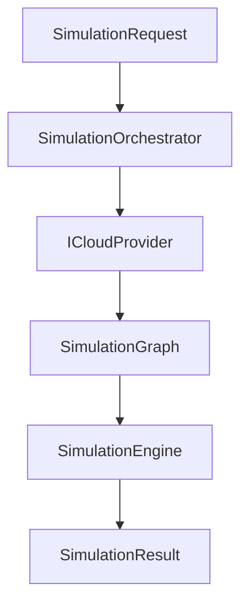

# ArchSim

ArchSim is a steady-state cloud architecture simulation engine.

It allows you to estimate:

- ⏱️ End-to-end latency
- ⚠️ Error presence (timeouts)
- 💰 Total monthly cost
- 📉 Cost per request

ArchSim is designed to be:

- Deterministic
- Fully testable
- Multi-cloud ready
- Provider-agnostic at the core engine level

---

# 🎯 Project Goal

ArchSim models a cloud architecture as a **Directed Acyclic Graph (DAG)** and simulates its behavior under steady-state load.

The engine:

- Propagates latency recursively
- Handles parallel branches (latency = max of branches)
- Detects timeouts
- Detects saturation
- Computes monthly cost
- Computes cost per request

It does **NOT** simulate:

- Real-time execution
- Discrete event systems
- Temporal scaling behavior
- Queuing systems

It is a mathematical steady-state simulation engine.

---

# 🏗️ Project Architecture

```
ArchSim
├── ArchSim.Domain        → Pure simulation engine
├── ArchSim.Azure         → Azure provider implementation
├── ArchSim.Application   → Orchestration layer + input contract
├── Tests                 → Extensive test coverage
```

---

# 🧠 Layered Design

## 1️⃣ Domain (Core Engine)

Contains:

- `SimulationGraph`
- `SimulationEngine`
- `SimulatedNode`
- `Connection`
- Cost model abstractions

The Domain layer is fully provider-agnostic.

It has **zero knowledge of Azure, AWS, or any cloud vendor**.

---

## 2️⃣ Azure Provider

Implements:

- AzureAppServiceProfile
- AzureSqlProfile
- SKU catalogs
- AzureCloudProvider

This layer translates Azure resources into `ISimulatedNode` instances.

---

## 3️⃣ Application Layer

Contains:

- `SimulationRequest`
- `SimulationResponse`
- `SimulationOrchestrator`
- `ICloudProvider` abstraction

This layer orchestrates providers and the simulation engine.

---

# 📊 Simulation Model

## Graph Model

An architecture is modeled as a DAG:

```
AppService
     ↓
   Azure SQL
```

Each resource is a node.  
Each call is a connection.

---

## Latency Model

For each node:

```
utilization = load / capacity
```

- If utilization <= 1 → latency = baseLatency
- If utilization > 1 → latency = baseLatency * utilization

For parallel branches:

```
totalLatency = nodeLatency + max(branchLatencies)
```

---

## Timeout Model

A timeout occurs if:

```
nodeLatency >= node.timeout
```

or

```
segmentLatency >= connection.timeout
```

Timeouts do NOT interrupt propagation.  
They only mark the simulation result as having errors.

---

## Cost Model

```
TotalMonthlyCost = sum(node.CalculateMonthlyCost(load))
CostPerRequest = TotalMonthlyCost / (load * 30 days)
```

If `load = 0` → `CostPerRequest = 0`.

---

# 🚀 Example Usage

## Example Input (JSON-like contract)

```json
{
  "provider": "Azure",
  "load": 300,
  "resources": [
    {
      "type": "AppService",
      "name": "App",
      "sku": "P1V2",
      "instanceCount": 2
    },
    {
      "type": "Sql",
      "name": "Sql",
      "sku": "Basic"
    }
  ],
  "connections": [
    {
      "from": "App",
      "to": "Sql",
      "networkLatency": 5
    }
  ]
}
```

---

## Example Orchestration

```csharp
var orchestrator = new SimulationOrchestrator(
    new[] { new AzureCloudProvider() });

var response = orchestrator.Run(request);

Console.WriteLine($"Latency: {response.TotalLatency}");
Console.WriteLine($"Monthly Cost: {response.TotalMonthlyCost}");
```

---

# 🧩 Core Engine Flow



---

# 🌍 Multi-Provider Architecture

ArchSim is designed for multi-cloud extensibility.

One simulation run uses a single provider.

```mermaid
flowchart TD
    A[SimulationRequest] --> B[SimulationOrchestrator]
    B --> C{Provider?}
    C -->|Azure| D[AzureCloudProvider]
    C -->|AWS (future)| E[AwsCloudProvider]
    C -->|GCP (future)| F[GcpCloudProvider]

    D --> G[Domain Engine]
    E --> G
    F --> G
```

The Domain engine remains untouched regardless of provider.

---

# 🧪 Test Coverage

The project is heavily test-driven.

Covered scenarios include:

- DAG validation
- Cycle detection
- Root validation
- Latency propagation
- Parallel branches
- Converging DAG
- Saturation behavior
- Timeout detection
- Provider mapping
- Full orchestration flow

The tests describe the engine behavior.

---

# 🔮 Roadmap

- REST API layer
- AWS provider implementation
- GCP provider implementation
- Region-aware latency modeling
- Advanced scaling models
- Probabilistic simulation mode

---

# 🧠 Design Philosophy

ArchSim strictly separates:

- Mathematical simulation engine
- Cloud provider implementations
- Application orchestration layer

This ensures:

- High testability
- Clear separation of concerns
- Natural extensibility
- Provider isolation

---

# 📌 Project Status

Active development.

Azure provider implemented.  
Multi-provider architecture ready.  
REST API planned.

---

# 👤 Author

Initiated and maintained by @cbonnaud